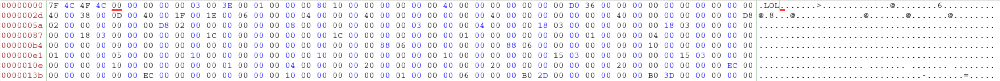

There were two questions given under Reversing - `xxxxx` and `elfish` both of which wanted us to go through the code thoroughly to properly analyse it.

---

## xxxxx

In this challenge we were given two files - `xxxxx.py` and `challenge.py`. The code seems to be confusing because all the functions seem to look like `xxxxx()`. In reality, all the `xxxxx` were different because characters with different unicode characters were used to create the function.
You just have to search and replace the repsective functions with their return values.
You will get the following code:

```python
a = [3,3,1, 3,1,3, 3, 1, 1,3, 1,1,3, 1, 3, 3,1, 1, 1, 13,1, 1, 1,  1, 1,  3, 1, 1]
b = [4,8,67,1,7,1, 13,11,7,11,4,5,17,19,17,4,41,19,11,2, 17,19,1,  3, 109,17,53,25]
c = [4,1,1, 4,2,41,1, 2, 1,1, 4,4,1, 1, 2, 4,2, 1, 1, 4, 1, 1, 1,  1, 1,  1, 1, 1]
d = [1,5,1, 7,5,1, 3, 5, 7,3, 3,5,1, 5, 1, 1,1, 5, 5, 1, 3, 5, 109,17,1,  1, 1, 5] 
```

```python
flag = [''] * 28
flag[0] = chr(a[0] * b[0] * c[0] * d[0])
flag[1] = chr(a[1] * b[1] * c[1] * d[1])
flag[1+1] = chr(a[1+1] * b[1+1] * c[1+1] * d[1+1])
flag[1+1+1] = chr(a[1+1+1] * b[1+1+1] * c[1+1+1] * d[1+1+1])
flag[1+1+1+1] = chr(a[1+1+1+1] * b[1+1+1+1] * c[1+1+1+1] * d[1+1+1+1])
flag[1+1+1+1+1] = chr(a[1+1+1+1+1] * b[1+1+1+1+1] * c[1+1+1+1+1] * d[1+1+1+1+1])
flag[1+1+1+1+1+1] = chr(a[1+1+1+1+1+1] * b[1+1+1+1+1+1] * c[1+1+1+1+1+1] * d[1+1+1+1+1+1])
flag[1+1+1+1+1+1+1] = chr(a[1+1+1+1+1+1+1] * b[1+1+1+1+1+1+1] * c[1+1+1+1+1+1+1] * d[1+1+1+1+1+1+1])
flag[1+1+1+1+1+1+1+1] = chr(a[1+1+1+1+1+1+1+1] * b[1+1+1+1+1+1+1+1] * c[1+1+1+1+1+1+1+1] * d[1+1+1+1+1+1+1+1])
flag[1+1+1+1+1+1+1+1+1] = chr(a[1+1+1+1+1+1+1+1+1] * b[1+1+1+1+1+1+1+1+1] * c[1+1+1+1+1+1+1+1+1] * d[1+1+1+1+1+1+1+1+1])
flag[1+1+1+1+1+1+1+1+1+1] = chr(a[1+1+1+1+1+1+1+1+1+1] * b[1+1+1+1+1+1+1+1+1+1] * c[1+1+1+1+1+1+1+1+1+1] * d[1+1+1+1+1+1+1+1+1+1])
flag[1+1+1+1+1+1+1+1+1+1+1] = chr(a[1+1+1+1+1+1+1+1+1+1+1] * b[1+1+1+1+1+1+1+1+1+1+1] * c[1+1+1+1+1+1+1+1+1+1+1] * d[1+1+1+1+1+1+1+1+1+1+1])
flag[1+1+1+1+1+1+1+1+1+1+1+1] = chr(a[1+1+1+1+1+1+1+1+1+1+1+1] * b[1+1+1+1+1+1+1+1+1+1+1+1] * c[1+1+1+1+1+1+1+1+1+1+1+1] * d[1+1+1+1+1+1+1+1+1+1+1+1])
flag[1+1+1+1+1+1+1+1+1+1+1+1+1] = chr(a[1+1+1+1+1+1+1+1+1+1+1+1+1] * b[1+1+1+1+1+1+1+1+1+1+1+1+1] * c[1+1+1+1+1+1+1+1+1+1+1+1+1] * d[1+1+1+1+1+1+1+1+1+1+1+1+1])
flag[1+1+1+1+1+1+1+1+1+1+1+1+1+1] = chr(a[1+1+1+1+1+1+1+1+1+1+1+1+1+1] * b[1+1+1+1+1+1+1+1+1+1+1+1+1+1] * c[1+1+1+1+1+1+1+1+1+1+1+1+1+1] * d[1+1+1+1+1+1+1+1+1+1+1+1+1+1])
flag[1+1+1+1+1+1+1+1+1+1+1+1+1+1+1] = chr(a[1+1+1+1+1+1+1+1+1+1+1+1+1+1+1] * b[1+1+1+1+1+1+1+1+1+1+1+1+1+1+1] * c[1+1+1+1+1+1+1+1+1+1+1+1+1+1+1] * d[1+1+1+1+1+1+1+1+1+1+1+1+1+1+1])
flag[1+1+1+1+1+1+1+1+1+1+1+1+1+1+1+1] = chr(a[1+1+1+1+1+1+1+1+1+1+1+1+1+1+1+1] * b[1+1+1+1+1+1+1+1+1+1+1+1+1+1+1+1] * c[1+1+1+1+1+1+1+1+1+1+1+1+1+1+1+1] * d[1+1+1+1+1+1+1+1+1+1+1+1+1+1+1+1])
flag[1+1+1+1+1+1+1+1+1+1+1+1+1+1+1+1+1] = chr(a[1+1+1+1+1+1+1+1+1+1+1+1+1+1+1+1+1] * b[1+1+1+1+1+1+1+1+1+1+1+1+1+1+1+1+1] * c[1+1+1+1+1+1+1+1+1+1+1+1+1+1+1+1+1] * d[1+1+1+1+1+1+1+1+1+1+1+1+1+1+1+1+1])
flag[1+1+1+1+1+1+1+1+1+1+1+1+1+1+1+1+1+1] = chr(a[1+1+1+1+1+1+1+1+1+1+1+1+1+1+1+1+1+1] * b[1+1+1+1+1+1+1+1+1+1+1+1+1+1+1+1+1+1] * c[1+1+1+1+1+1+1+1+1+1+1+1+1+1+1+1+1+1] * d[1+1+1+1+1+1+1+1+1+1+1+1+1+1+1+1+1+1])
flag[1+1+1+1+1+1+1+1+1+1+1+1+1+1+1+1+1+1+1] = chr(a[1+1+1+1+1+1+1+1+1+1+1+1+1+1+1+1+1+1+1] * b[1+1+1+1+1+1+1+1+1+1+1+1+1+1+1+1+1+1+1] * c[1+1+1+1+1+1+1+1+1+1+1+1+1+1+1+1+1+1+1] * d[1+1+1+1+1+1+1+1+1+1+1+1+1+1+1+1+1+1+1])
flag[1+1+1+1+1+1+1+1+1+1+1+1+1+1+1+1+1+1+1+1] = chr(a[1+1+1+1+1+1+1+1+1+1+1+1+1+1+1+1+1+1+1+1] * b[1+1+1+1+1+1+1+1+1+1+1+1+1+1+1+1+1+1+1+1] * c[1+1+1+1+1+1+1+1+1+1+1+1+1+1+1+1+1+1+1+1] * d[1+1+1+1+1+1+1+1+1+1+1+1+1+1+1+1+1+1+1+1])
flag[1+1+1+1+1+1+1+1+1+1+1+1+1+1+1+1+1+1+1+1+1] = chr(a[1+1+1+1+1+1+1+1+1+1+1+1+1+1+1+1+1+1+1+1+1] * b[1+1+1+1+1+1+1+1+1+1+1+1+1+1+1+1+1+1+1+1+1] * c[1+1+1+1+1+1+1+1+1+1+1+1+1+1+1+1+1+1+1+1+1] * d[1+1+1+1+1+1+1+1+1+1+1+1+1+1+1+1+1+1+1+1+1])
flag[1+1+1+1+1+1+1+1+1+1+1+1+1+1+1+1+1+1+1+1+1+1] = chr(a[1+1+1+1+1+1+1+1+1+1+1+1+1+1+1+1+1+1+1+1+1+1] * b[1+1+1+1+1+1+1+1+1+1+1+1+1+1+1+1+1+1+1+1+1+1] * c[1+1+1+1+1+1+1+1+1+1+1+1+1+1+1+1+1+1+1+1+1+1] * d[1+1+1+1+1+1+1+1+1+1+1+1+1+1+1+1+1+1+1+1+1+1])
flag[1+1+1+1+1+1+1+1+1+1+1+1+1+1+1+1+1+1+1+1+1+1+1] = chr(a[1+1+1+1+1+1+1+1+1+1+1+1+1+1+1+1+1+1+1+1+1+1+1] * b[1+1+1+1+1+1+1+1+1+1+1+1+1+1+1+1+1+1+1+1+1+1+1] * c[1+1+1+1+1+1+1+1+1+1+1+1+1+1+1+1+1+1+1+1+1+1+1] * d[1+1+1+1+1+1+1+1+1+1+1+1+1+1+1+1+1+1+1+1+1+1+1])
flag[1+1+1+1+1+1+1+1+1+1+1+1+1+1+1+1+1+1+1+1+1+1+1+1] = chr(a[1+1+1+1+1+1+1+1+1+1+1+1+1+1+1+1+1+1+1+1+1+1+1+1] * b[1+1+1+1+1+1+1+1+1+1+1+1+1+1+1+1+1+1+1+1+1+1+1+1] * c[1+1+1+1+1+1+1+1+1+1+1+1+1+1+1+1+1+1+1+1+1+1+1+1] * d[1+1+1+1+1+1+1+1+1+1+1+1+1+1+1+1+1+1+1+1+1+1+1+1])
flag[1+1+1+1+1+1+1+1+1+1+1+1+1+1+1+1+1+1+1+1+1+1+1+1+1] = chr(a[1+1+1+1+1+1+1+1+1+1+1+1+1+1+1+1+1+1+1+1+1+1+1+1+1] * b[1+1+1+1+1+1+1+1+1+1+1+1+1+1+1+1+1+1+1+1+1+1+1+1+1] * c[1+1+1+1+1+1+1+1+1+1+1+1+1+1+1+1+1+1+1+1+1+1+1+1+1] * d[1+1+1+1+1+1+1+1+1+1+1+1+1+1+1+1+1+1+1+1+1+1+1+1+1])
flag[1+1+1+1+1+1+1+1+1+1+1+1+1+1+1+1+1+1+1+1+1+1+1+1+1+1] = chr(a[1+1+1+1+1+1+1+1+1+1+1+1+1+1+1+1+1+1+1+1+1+1+1+1+1+1] * b[1+1+1+1+1+1+1+1+1+1+1+1+1+1+1+1+1+1+1+1+1+1+1+1+1+1] * c[1+1+1+1+1+1+1+1+1+1+1+1+1+1+1+1+1+1+1+1+1+1+1+1+1+1] * d[1+1+1+1+1+1+1+1+1+1+1+1+1+1+1+1+1+1+1+1+1+1+1+1+1+1])
flag[1+1+1+1+1+1+1+1+1+1+1+1+1+1+1+1+1+1+1+1+1+1+1+1+1+1+1] = chr(a[1+1+1+1+1+1+1+1+1+1+1+1+1+1+1+1+1+1+1+1+1+1+1+1+1+1+1] * b[1+1+1+1+1+1+1+1+1+1+1+1+1+1+1+1+1+1+1+1+1+1+1+1+1+1+1] * c[1+1+1+1+1+1+1+1+1+1+1+1+1+1+1+1+1+1+1+1+1+1+1+1+1+1+1] * d[1+1+1+1+1+1+1+1+1+1+1+1+1+1+1+1+1+1+1+1+1+1+1+1+1+1+1])
print(''.join(flag))
```

Now run the code, you will get the flag:

```
0xCTF{y_U_g0tta_b_s0_elf1$h}
```

--- 
## elfish

You are provided with a binary file called 'elfish' that will not run on your pc. This is because the binary file is corrupted. When you try to analyze the type of the file.

If you try to analyse the file headers using:
```
readelf -h ./elfish
```
It returns the following error:
```
readelf: ./elfish: Error: Not an ELF file - it has the wrong magic bytes at the start
```
The only thing that we have to do now is to open the file using a Hex Editor like Bless and try to edit the Magic bytes at the start.



After changing:


The .elf file was compiled for aarch64 architecture. So we have to find a way to run it on x86_64 architecture. Refer the following link: https://azeria-labs.com/arm-on-x86-qemu-user/

Once you manage to make the aarch64 binary run on your pc to get the flag:
```
0xCTF{y_U_g0tta_b_s0_elf1$h}
```