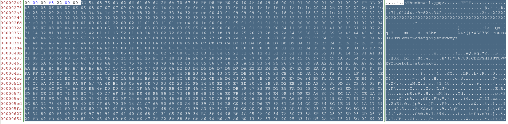
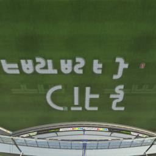

There were three questions related to forensics which involved analysing and finiding out data hidden in certain images.

---
## Pixelated Secrets 1

### Image
We were provided with the following image:


### Approach
This is a classic case of steganography and so when you directl run `zsteg` on the image because there is a bit of zlib compressed data in the file, you directly get the data hidden in the image.

You can install `zsteg` from this link: https://github.com/zed-0xff/zsteg

You just have to run the command:
```

```

The answer is therefore:
```
0xCTF{Glad_you_remember_me}
```

---
## Uber Bug Bounty

### Files
We were provided with a `ctf.Challenge.Gbx`.

### Approach
```
strings ctf.Challenge.Gbx
```
shows that there are certain files related to `Nadeo` and `Trackmania`. If you have `Trackmania`, you can directly load the file as a save file and see the image.

Otherwize you can notice that there exists a `Thumbnail.jpg` image inside the file which you can extract using a Hex Editor like `Bless`.

When we open the file we have the following thumbnail:


After saving the binary, we get the following jpg file:


The words written on the image are:

```
CTF{FASTASF}
```

---
## Pixelated Secrets 2

### Image
We were provided with the following image:


### Approach
The approach is very straightaway in the beginning when you can directly use an [RSA cipher decoder](https://www.dcode.fr/rsa-cipher)

The decrypted value is:
```
531095210810895110
```
This is where we have to start thinking different. Here we can assume that the above value is a concatenation of the ASCII values of characters.

```
53 109 52 108 108 95 110 = 5m4ll_n
```

So the answer is:
```
0xCTF{5m4ll_n}
```