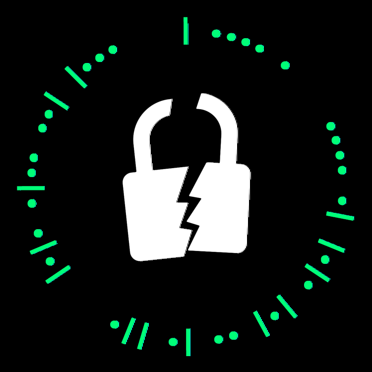

There were three questions related to forensics which involved analysing and finiding out data hidden in certain images.

---
## Pixelated Secrets 1

### Image
We were provided with the following image:


### Approach
This is a classic case of steganography and so when you directl run `zsteg` on the image because there is a bit of zlib compressed data in the file, you directly get the data hidden in the image.

You can install `zsteg` from this link: https://github.com/zed-0xff/zsteg

You just have to run the command:
```
zsteg easy_version.png -b 1 -o yx -v
```

The terminal output will be:


The answer is therefore:
```
CTF{22s05a2005}
```

---
## Uber Bug Bounty

### Files
We were provided with a `ctf.Challenge.Gbx`.

### Approach
```
strings ctf.Challenge.Gbx
```
shows that there are certain files related to `Nadeo` and `Trackmania`. If you have `Trackmania`, you can directly load the file as a save file and see the image.

Otherwize you can notice that there exists a `Thumbnail.jpg` image inside the file which you can extract using a Hex Editor like `Bless`.

When we open the file we have the following thumbnail:


After saving the binary, we get the following jpg file:


The words written on the image are:

```
CTF{FASTASF}
```

---
## Pixelated Secrets 2

### Image
We were provided with the following image:


### Approach
After trying out a lot of zsteg based commands we were left with nothing useful, that could lead us to a flag.

Then we tried to analyse the bit planes of the image and found out some interesting data in the Red 0 bit plane:


I then proceeded to open the bit plane image in gimp and started counting the dots as 1 and the blanks as 0.
Soon I noticed that we were supposed to select only alternate bits and then started writing down the bits.

I noticed that it looked like ASCII code and then used that realization to convert it to the flag.

Later I noticed that I could have done this in python using the code written below:
```
from PIL import Image

def open_image(file_path):
    return Image.open(file_path)

    
def get_pixel_values(image, row):
    return [image.getpixel((x, row))[2] for x in range(image.width)]

def extract_binary_data(pixel_values):
    return ''.join(map(str, pixel_values))

def decode_binary_string(binary_string):
    return ''.join(chr(int(binary_string[i*8:i*8+8], 2)) for i in range(len(binary_string)//8))

def main():
    image_path = 'hard_version.png'
    image = open_image(image_path)

    row_to_extract = 0
    pixel_values = get_pixel_values(image, row_to_extract)
    binary_data = extract_binary_data(pixel_values)
    res = ''.join(binary_data[x] for x in range(1, len(binary_data), 2))
    decoded_message = decode_binary_string(res)

    print(decoded_message)

if __name__ == "__main__":
    main()
```
You can also refer to: https://web.iiit.ac.in/~rinishsam.i/buzzoverflow-writeups/#/?id=pixelated-secrets-2 for his shorted and more elegant approach.

The flag is:
```
CTF{S3cure_22}
```