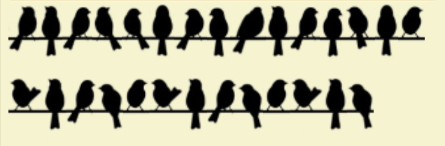

There were three questions related to cryptography which involved analysing and finiding out what kind of cipher was used to create the encoded text given to us.

---
## The Emperor's Secret

### Ciphertext
We were provided with the following cipher text:
```
Jodg_brx_uhphpehu_ph
```

### Approach
The name, the Emperor's Secret is a big hint towards the kind of cipher it could have been, i.e. - Ceaser Cipher. However if you were unable to analyze this you can use online software like [dCode cipher analyser](https://www.dcode.fr/cipher-identifier) which can help you in identifying that the cipher is indeed the `Ceaser Cipher`.

Once you get the cipher algorithm used, you can use a tool like [dCode Cipher Decoder](https://www.dcode.fr/caesar-cipher) which can bruteforce through all possible shifts and give you the most probable answer(s).

For this question, the answer is obtained for a shift of 23. Where you get the decoded output as: `Glad_you_remember_me`.

The answer is therefore:
```
0xCTF{Glad_you_remember_me}
```

---
## Nature's Secret

### Ciphertext
We were provided with the following cipher image:


### Approach
The photo itself is a very big giveaway to the kind of cipher that was used. You just have to search for "Birds on a Wire Cipher" and you will get what you require.

You can use a decder from [dCode](https://www.dcode.fr/birds-on-a-wire-cipher).

The answer is therefore:
```
0xCTF{birdsonawiregochirpchirpchip}
```

---
## Does size matter?

### Ciphertext
We were provided with the following cipher values of an RSA encryption:
Cipher text: `46163498626677786993275746470510`\
N(Public Key): `50537019332326445555049589372337`\
D(Private Key): `49623239819855508877100187645953`

### Approach
The approach is very straightaway in the beginning when you can directly use an [RSA cipher decoder](https://www.dcode.fr/rsa-cipher)

The decrypted value is:
```
531095210810895110
```
This is where we have to start thinking different. Here we can assume that the above value is a concatenation of the ASCII values of characters.

```
53 109 52 108 108 95 110 = 5m4ll_n
```

So the answer is:
```
0xCTF{5m4ll_n}
```