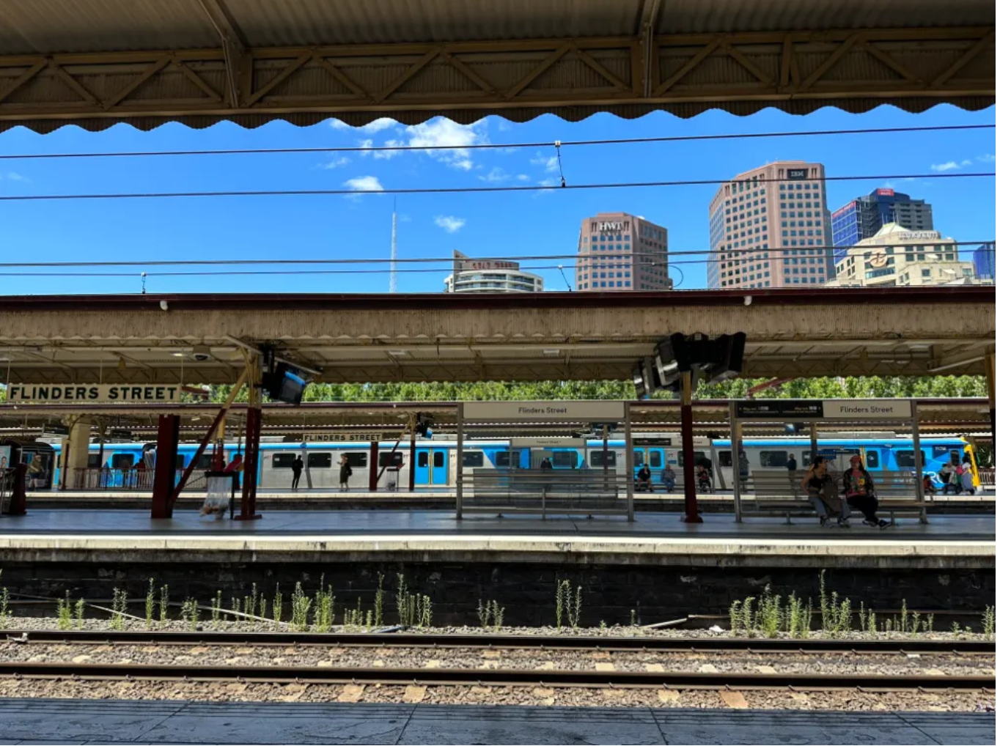

There was one OSINT question, regarding the tallest building in an image.

---
## Google's Your Friend

### Image
We were provided with the following image:


### Approach
This problem is very easy if you know to use google maps and google image search well. When you image search for the above image, it will lead you to `Flinders Street Railway Station` and then using google maps street view you can try to find out the name of the tallest building you see.

This building is the Focus Apartments which stands at a height of 166m.

However, because this is a question asked in a previous CTF, if you are able to search for image origin, it will lead you to this solution already given in Medium: https://medium.com/@w9b3N/challenge-to-osint-exercise-002-7d4036debdef

This just remove the fun though!!

The flag is:
```
0xCTF{166}
```